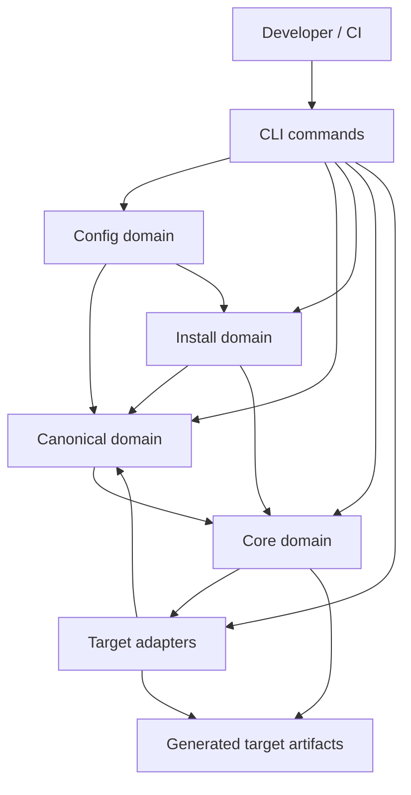

# Container And Component View

This is a C4-lite view for the library. The "containers" here are code domains, not deployable services.

## System view

## Domain responsibilities

- CLI:
  Parse command intent and coordinate high-level workflows.
- Config:
  Find config files, validate schema, resolve extends, fetch remotes, manage locks.
- Canonical:
  Parse `.agentsmesh/`, load extends/packs, and merge into one `CanonicalFiles` graph.
- Install:
  Turn local or remote sources into either extends entries or materialized packs.
- Core:
  Execute target-agnostic generation, rewriting, linting, and compatibility reporting.
- Targets:
  Define each tool's native structure and translation rules.
- Utils:
  Provide low-level reusable helpers with no business-policy ownership.

## Component-level decomposition

- `src/config/core`
  config schema, config loader, lock behavior, conversion rules.
- `src/config/remote`
  remote source parsing and fetch orchestration.
- `src/config/resolve`
  native-format detection and extend path resolution.
- `src/canonical/features`
  canonical parsers for rules, commands, agents, skills, and settings-like files.
- `src/canonical/extends`
  extend loading, extend pick logic, and merge-order orchestration.
- `src/canonical/load`
  base canonical loading, pack loading, and merge helpers.
- `src/core/generate`
  generation engine, optional features, collision handling, root decoration.
- `src/core/reference`
  reference maps, artifact path maps, and rewrite logic.
- `src/core/lint`
  shared lint orchestration for rules, hooks, permissions, and MCP.
- `src/install/run`
  top-level install orchestration and sync/replay flow.
- `src/install/core|manual|native|pack|source`
  discovery, selection, source parsing/fetching, and pack persistence pieces.
- `src/targets/catalog`
  built-in target registry and capabilities.
- `src/targets/import`
  shared import helpers.
- `src/targets/projection`
  shared projected-agent and root-instruction helpers.

## Dependency rules

- `utils` should not depend on higher-level domains.
- `targets/<tool>` may depend on `targets/catalog|import|projection`, `core/types`, `config/core`, and `utils`.
- `core` should stay target-agnostic except through target metadata and generator contracts.
- `canonical` should not call CLI code.
- `install` may orchestrate `canonical`, `config`, and `core`, but should not absorb target-specific layout rules directly.
- `cli` is allowed to coordinate all domains but should avoid embedding low-level parsing logic.

## Notable coupling to watch

- `config/remote/remote-fetcher.ts` currently reaches into `install/pack/cache-cleanup.ts`.
  That works, but it is a cross-domain utility dependency disguised as config behavior.
- `install/run/run-install.ts` is still the densest orchestration module.
  The structure is better than before, but it remains the highest-change install surface.
