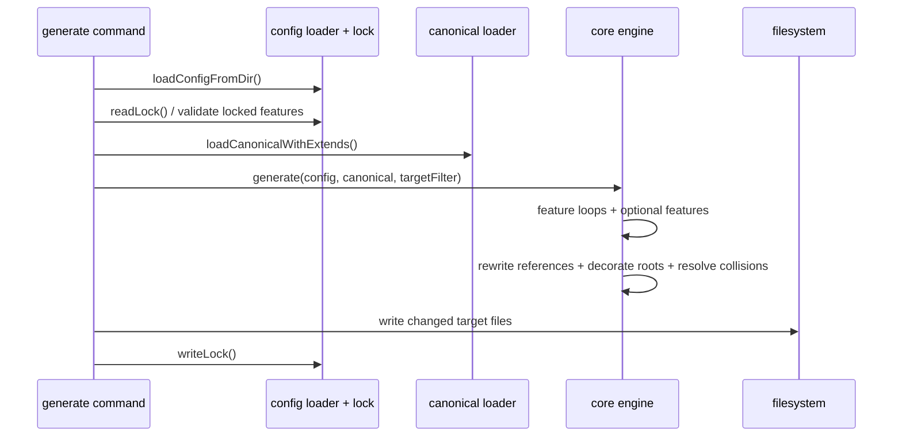

# Generate Flow

`agentsmesh generate` is the primary projection pipeline from canonical state to target artifacts.

## Entry point

- CLI command:
  `src/cli/commands/generate.ts`
- Core engine:
  `src/core/generate/engine.ts`

## Sequence

## Inputs

- `agentsmesh.yaml`
- `agentsmesh.local.yaml`
- `.agentsmesh/`
- resolved extends
- materialized packs under `.agentsmesh/packs/`

## Outputs

- target-native files and directories
- `.agentsmesh/.lock`
- optional `.agentsmeshcache` symlink

## Important rules

- lock strategy `lock` blocks generation unless `--force` is supplied when locked canonical features changed
- `--check` does not write files
- `--dry-run` reports planned writes without touching the filesystem
- feature generation is target-capability-aware and routed through built-in target metadata

## Failure points

- invalid config or missing config
- locked feature violations
- unsafe output paths
- target collision resolution producing conflicting artifacts
- filesystem write failures

## Architectural reason this flow matters

This is the central library contract. Every other workflow either feeds canonical state into this flow or validates the results of this flow.
