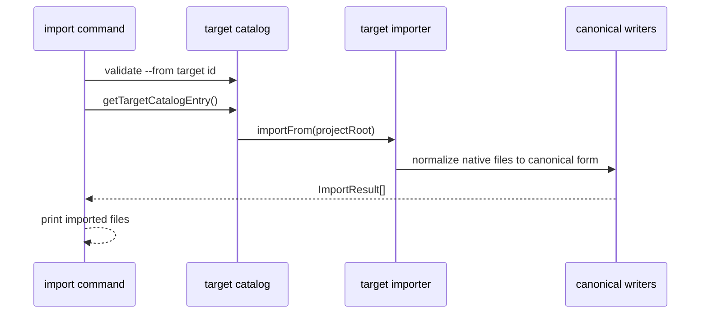

# Import Flow

`agentsmesh import` normalizes one target's native structure back into canonical `.agentsmesh/` files.

## Entry point

- CLI command:
  `src/cli/commands/import.ts`
- Target catalog:
  `src/targets/catalog/target-catalog.ts`

## Sequence

## Inputs

- one target id via `--from`
- project root with target-native files

## Outputs

- canonical files under `.agentsmesh/`
- no automatic regenerate step

## Shared import helpers

- `src/targets/import/import-metadata.ts`
- `src/targets/import/import-orchestrator.ts`
- `src/targets/import/shared-import-helpers.ts`
- `src/targets/import/embedded-skill.ts`

## Important rules

- import must preserve canonical semantics, not target-specific wording
- generated root-instruction decoration is stripped back out during import
- projected or embedded target artifacts must round-trip back into canonical features
- empty imports should return target-specific "nothing found" messaging rather than silently succeeding

## Failure points

- unsupported `--from`
- malformed frontmatter or unsupported native file shapes
- missing expected target files
- lossy translation between target-native and canonical representations
