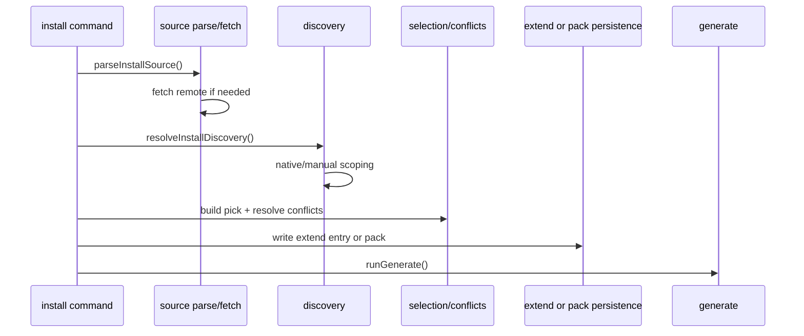

# Install Flow

`agentsmesh install` is the most orchestration-heavy workflow. It turns an external or local source into either a config extend entry or a materialized pack.

## Entry point

- CLI command:
  `src/cli/commands/install.ts`
- Orchestration:
  `src/install/run/run-install.ts`

## Sequence

## Inputs

- local path, `github:`, `gitlab:`, or `git+...` source
- optional `--path`, `--target`, `--as`, `--name`
- optional replay data from installs manifest sync

## Outputs

- updated `agentsmesh.yaml` extend entry, or
- materialized pack under `.agentsmesh/packs/`
- regenerated target artifacts

## Major install subdomains

- `install/source`
  source parsing and remote fetch helpers
- `install/core`
  discovery, selection, names, manifest writing, conflict resolution
- `install/manual`
  explicit collection-mode behavior and persistence
- `install/native`
  target-native discovery and scoped import behavior
- `install/pack`
  pack read/write/merge/hash/cache concerns
- `install/run`
  orchestration, sync, replay

## Important rules

- native discovery is staged and importer-driven rather than mutating the source checkout
- replayed installs must preserve saved feature scope and picks
- dry-run must avoid writes
- materialized packs participate in canonical loading before local canonical files are merged

## Failure points

- unsupported or missing source
- git not available for remote installs
- invalid or empty discovered resources
- conflict resolution resulting in zero selected items
- generate failure after persistence
