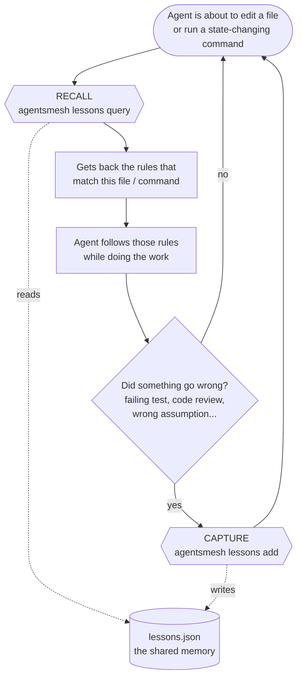
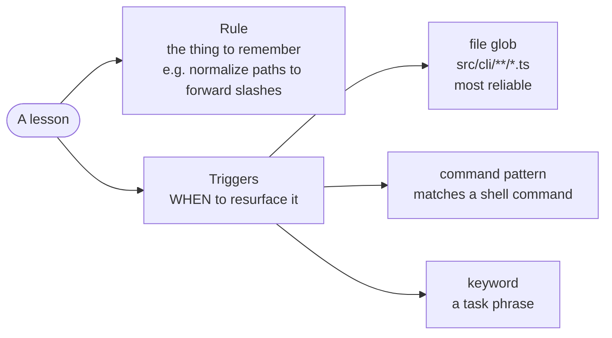
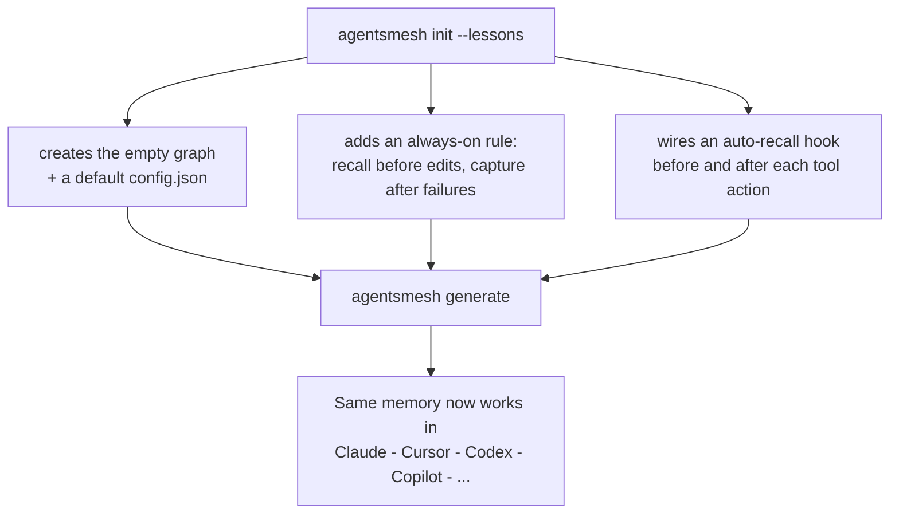

# Lessons Flow

> **The one big idea:** *Lessons* give an AI coding agent a **memory of past mistakes**.
> It **reads** that memory *before* it touches anything, and **writes** to it *after* something goes wrong — so the same mistake doesn't happen twice, in any tool.

That memory is a single git-tracked file: `.agentsmesh/lessons/lessons.json`. Every agent (Claude, Cursor, Codex, Copilot, …) reads and writes the *same* file through two commands.

## The daily loop

Two habits, repeated all day: **Recall before you act**, **Capture after a failure**.



- **Recall** runs *before* an edit or a state-changing command (build, test, install, git-write). It asks the graph "any rules for this file or command?" and the agent applies whatever comes back. Pure reads (`cat`, `ls`, `grep`) are exempt.
- **Capture** runs *right after a failure* — and "failure" is broad: a red test, a lint/type error, a code review comment, a regression, or just a wrong assumption. The agent writes down the rule so next time, Recall surfaces it.

## What's inside one lesson

A lesson is a short **rule** plus one or more **triggers** that decide *when* it should resurface.



Prefer a **file glob** trigger — it's the one Recall fires on most reliably. A lesson whose every trigger is dead on the file/command path could never be recalled, so capturing one is rejected (you'll be told why).

## How it reaches every tool

You set it up once. `generate` then projects the same memory into every AI tool you use.



## A 30-second example

```bash
# 1. One-time setup
agentsmesh init --lessons && agentsmesh generate

# 2. You hit a bug: a Windows path broke because of a backslash.
#    Capture the lesson so it never bites again:
agentsmesh lessons add "Normalize CLI display paths to forward slashes" \
  --topic windows-paths \
  --new-topic --topic-summary "Cross-platform path handling" \
  --trigger-file "src/cli/**/*.ts"

# 3. Later, before editing a CLI file, the agent recalls it automatically:
agentsmesh lessons query --file src/cli/foo.ts
#   -> Normalize CLI display paths to forward slashes
```

The graph is a normal git-tracked file, so lessons are shared with your team and every change is reviewable and reversible.

## Where to go next

- **CLI reference** — every subcommand and flag: [`website/.../cli/lessons`](../../../website/src/content/docs/cli/lessons.mdx)
- **Concepts & guardrails** — ranking, dedup, capture guardrails, telemetry: [`website/.../reference/lessons`](../../../website/src/content/docs/reference/lessons.mdx)
- **Tuning** — `.agentsmesh/lessons/config.json` (`recallLimit`, `recallMaxTokens`, `autoPrune`); `init --lessons` writes it with sensible defaults.

## Under the hood (for contributors)

- Recall + capture entry points (migration-aware): `recallLessons` / `captureLesson` in `src/lessons/recall.ts`
- The canonical graph + transactional writes: `src/lessons/mutate.ts` (lock → load → mutate → validate → atomic save)
- Setup/scaffold: `scaffoldLessons` in `src/lessons/init.ts`
- Trigger matching + ranking: `src/lessons/query.ts`, `src/lessons/ranking.ts`
