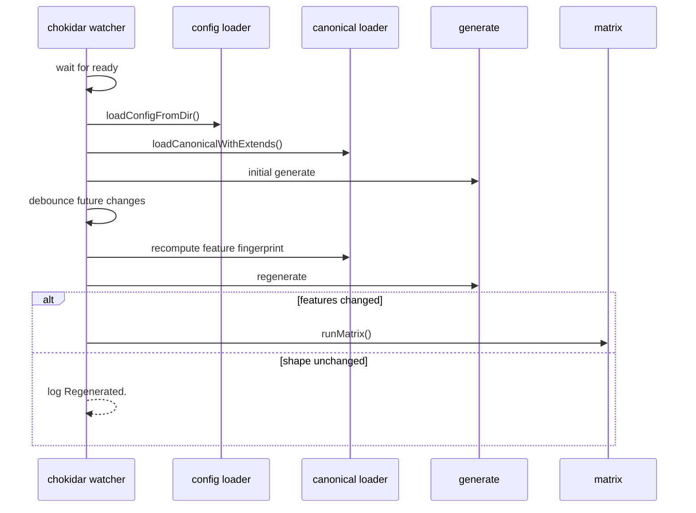

# Watch Flow

`agentsmesh watch` is a thin reactive wrapper around generate plus optional matrix refresh.

## Entry point

- CLI command:
  `src/cli/commands/watch.ts`

## Sequence

## Watched inputs

- `.agentsmesh/`
- `agentsmesh.yaml`
- `agentsmesh.local.yaml`

## Important rules

- watcher waits for chokidar `ready` before the initial generate
- self-generated lock churn is ignored
- debounce is currently `300ms`
- matrix is only re-run when the feature fingerprint changes, not for every content edit

## Failure points

- missing config
- startup races if watcher readiness is skipped
- self-trigger loops from generated files if ignore filtering regresses
- missed edits if fingerprint or debounce logic changes incorrectly

## Why this flow matters

`watch` is where aggregate suite timing exposed real architectural coupling between filesystem behavior, lock writes, and generation. It should stay small and intentionally conservative.
