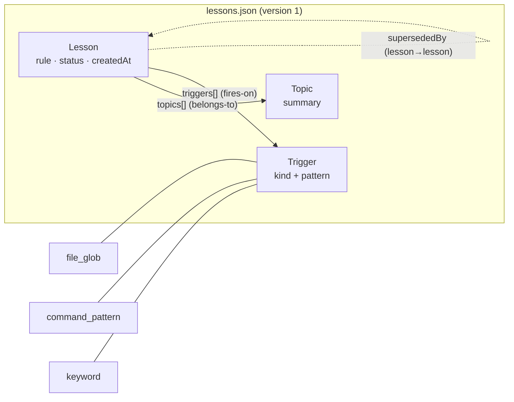
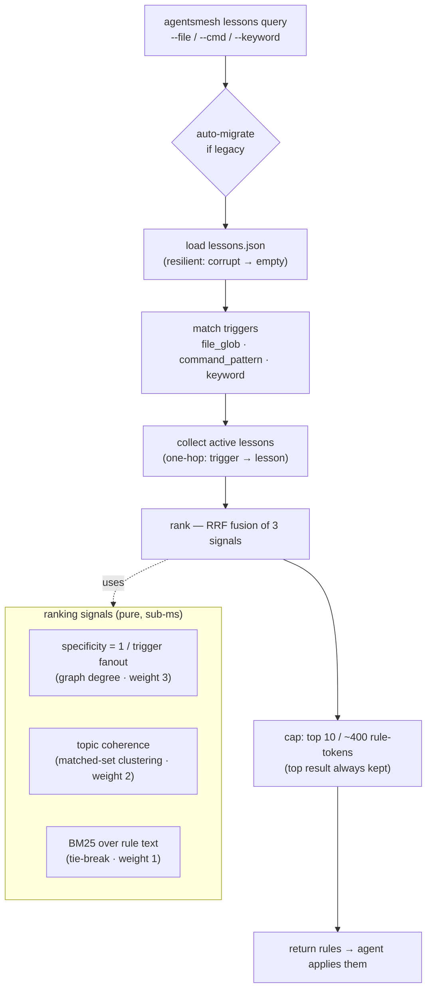
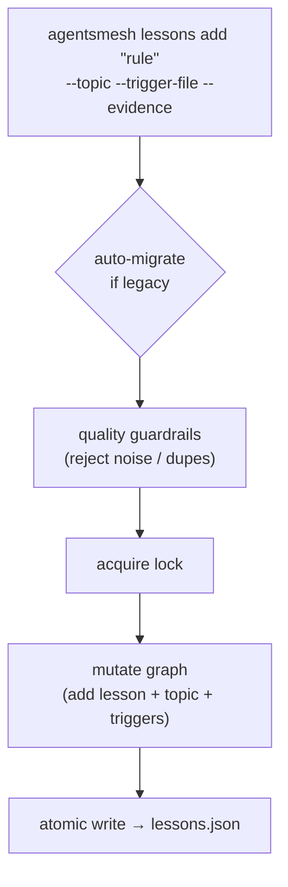
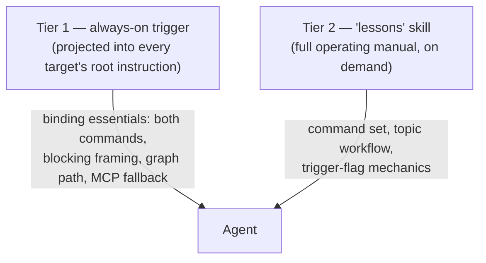

# Lessons System — How It Works

The lessons system is **two shell commands over one canonical graph**: **Recall**
(read, before you act) and **Capture** (write, after you learn something durable).
The graph at `.agentsmesh/lessons/lessons.json` is the single source of truth.

## Data model — a shallow, single-hop graph

Three id-keyed node tables, connected by typed id references (edges).

- **Lesson** → many **Topics** and many **Triggers** (both many-to-many).
- **Lesson** → optional `supersededBy` (a lesson→lesson edge; superseded/deprecated
  lessons are filtered out of recall, not traversed).
- A **Trigger** is one of three kinds: `file_glob`, `command_pattern`, or `keyword`.

## Recall — before every edit / command

A tool is about to run. Its file path and/or command are matched against every
trigger; lessons behind the matched triggers are collected, ranked, and capped.

Matching is OR across fields: a lesson surfaces if **any** of its triggers match
**any** supplied field. Command patterns run through a non-backtracking linear
regex engine under a shared work budget (never a backtracking regex on the hot
path). There is **no read-only carve-out** — recall fires before reads too.

## Capture — after you learn something durable

Capture is value-based, not event-based: write a lesson only when a **durable,
generalizable rule** emerged that will change a future action — a root-caused bug,
a constraint learned from the code, a wrong assumption that will recur, or a human
correction that generalizes. One-offs, typos, and environment flukes are skipped —
a noisy graph degrades recall for everyone.

## Two-tier delivery

- **Tier 1** rides canonical rules (`LESSONS_PROCEDURAL_RULE`) → reaches every
  target via generation. Minimal, to keep always-on context lean.
- **Tier 2** rides a canonical skill (`LESSONS_SKILL_BODY`) → expansive how-to that
  can grow without bloating every target.

No shell? The `lessons_query` / `lessons_add` MCP tools are the same two operations.

## Key properties

| Property | Detail |
| --- | --- |
| Source of truth | `.agentsmesh/lessons/lessons.json` — never hand-edited |
| Recall cost | ~sub-ms graph work (process spawn dominates wall-clock) |
| Recall caps | top 10 lessons / ~400 rule-tokens; top result always kept |
| Ranking | weighted RRF: specificity (3) · topic coherence (2) · BM25 (1) |
| Safety | resilient load (corrupt → empty recall), linear regex engine, atomic writes |
| Graph depth | single-hop joins — no traversal, pathfinding, or transitive closure |
