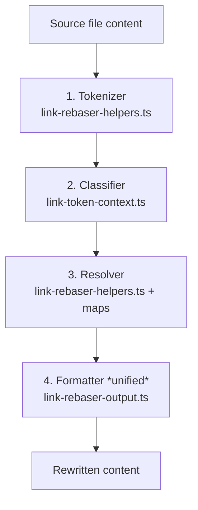

# Unified Link Rebaser — Architecture & Vision

Status: Proposal / RFC
Author: architecture review (senior)
Scope: `src/core/reference/*` — the generate- and import-side path rewriter applied to every markdown-like generated artifact.

---

## 1. Problem statement

The current rebaser resolves path tokens correctly, but its **output formatting** produces unreadable strings in real artifacts. Two representative regressions from `pnpm generate` on `master`:

```text
# .claude/skills/add-agent-target/SKILL.md  (inline-code prose)
-  canonical `.agentsmesh/` contract
+  canonical `./` contract                      ← well-known anchor destroyed

-  canonical `.agentsmesh/...` references
+  canonical `./...` references                 ← ambiguous, looks like same-dir

# .claude/skills/add-agent-target/references/target-addition-checklist.md
- `../../../../src/cli/commands/import.ts`
+ `src/cli/commands/import.ts`                  ← bare, not resolvable from this file

# .claude/skills/prepare-release/SKILL.md
- `../../../tests/unit/cli/commands/watch.test.ts`
+ `tests/unit/cli/commands/watch.test.ts`       ← bare, not resolvable from this file

# .claude/skills/prepare-release/SKILL.md
- `.agentsmesh/`, `docs/`, `tasks/`
+ `./`, `docs/`, `tasks/`                       ← `.agentsmesh/` erased, `./` misleading
```

The common pattern: **well-known anchors (`.agentsmesh/`, project-root, `~/`) are silently dropped** in favor of either destination-relative (`./`, `../`) or bare path-root-relative (`src/…`) forms. Both forms are ambiguous to a human reader and frequently do not resolve correctly in IDE/markdown renderers that treat un-prefixed paths as relative to the file.

The *resolution* logic is sound — the *formatting* logic optimises for "shortest string" instead of "readable + resolvable everywhere".

---

## 2. Why this happens today

Reading `src/core/reference/link-rebaser-output.ts`:

1. `formatLinkPathForDestination()` picks one of two strategies based on whether the *target* is under `.agentsmesh/`:
   - **Mesh-root-relative**: strips the `.agentsmesh/` prefix entirely → `skills/foo/`, and collapses `.agentsmesh/` itself to `.` which gains a trailing slash → `./`.
   - **Project-root-relative**: returns `path.relative(projectRoot, target)` → `src/cli/foo.ts` with no prefix.

2. The *destination* file's actual location (`.claude/skills/.../SKILL.md`, four levels deep) is **not** used to decide the output form — only to break ties via `compareFormattedLinks()` which prefers `./` < `../` < absolute.

3. Mesh-stripping is applied to *directories* unconditionally (`treatAsDirectory`), even when the occurrence is an inline-code documentation reference, not a navigable link. The rebaser has no notion of "prose vs link".

4. The `./` that `toAgentsMeshRootRelative()` returns for the mesh root itself is *syntactically the same string* as a destination-relative "current folder" link, but they mean different things. A reader cannot tell which.

5. Project-root-relative output never gains a leading `./` or `/`, so `src/foo.ts` in `.claude/skills/add-agent-target/references/foo.md` is indistinguishable from an intended sibling path and will resolve wrongly in VS Code, JetBrains, and any markdown renderer that treats bare paths as file-relative.

### Summary of root causes

| Root cause | Effect |
|---|---|
| No **reading-context classification** (prose vs navigable link vs quoted vs bracketed) | Inline-code prose gets rewritten as if it were a link destination. |
| "Shortest wins" tie-breaker in `compareFormattedLinks()` | `./`, `../…` chosen over the more anchored form even when ambiguous. |
| `toAgentsMeshRootRelative()` can emit `.` / `./` | Collapses the canonical well-known anchor (`.agentsmesh/`) into a destination-ambiguous token. |
| Project-root-relative output emits bare `src/foo.ts` | Ambiguous from the reader's and from most renderers' perspectives. |
| Output form is chosen from **target** position only | Destination depth and destination neighborhood are ignored. |

---

## 3. Design principles for the unified rebaser

The right fix is not another branch inside `formatLinkPathForDestination()`. It is a small, coherent model with one selection layer and one formatting layer.

### 3.1 Correctness first, then readability, then brevity

Order of objectives when picking an output form:

1. **Resolvable.** The rendered string must resolve to the same filesystem location a canonical reader would reach, from the destination file, in common markdown/IDE renderers.
2. **Readable.** A reader who does not know where the destination file is on disk should be able to guess which real file is meant from the output string alone.
3. **Short.** All else equal, the shorter string wins. Never at the cost of (1) or (2).

Today's code inverts this — shortest wins with only a partial correctness check.

### 3.2 Preserve well-known anchors in prose

A well-known anchor is a path prefix whose meaning is globally understood in this project:

- `.agentsmesh/` — canonical source of truth
- `.claude/`, `.cursor/`, `.github/`, `.codex/`, … — generated tool surfaces
- `src/`, `tests/`, `docs/` — project convention roots
- `~/` — user home
- `/` (leading slash) — absolute path
- `http://`, `https://`, `ssh://`, `git@…`, `file://`, `mailto:` — external URIs
- `C:\` / Windows drives — absolute path

**Rule:** when a token in *prose* (inline code, bracketed reference, quoted string) begins with a well-known anchor, the output must begin with the *same kind of* well-known anchor. Never collapse `.agentsmesh/` to `.`; never strip the leading segment of `src/foo.ts`.

### 3.3 Distinguish reading context from writing context

- **Writing context** — a real markdown hyperlink `[label](dest)` whose `dest` is rendered as a link by the viewer. The path must resolve from the destination file.
- **Reading context** — inline code `` `path` ``, bracketed reference `<path>`, quoted reference `"path"`, plain prose mention. The reader uses the path as an identifier, not a clickable link.

Today's `shouldRewritePathToken()` already discriminates these cases to decide *whether* to rewrite. The new rebaser must also use them to decide *how* to format.

### 3.4 One source of "what form am I in?" — a typed output shape

Output strings should carry a tag during selection so that comparison and fallback know what they are comparing. A tagged union instead of ad-hoc string prefixes:

```ts
type RewrittenLink =
  | { kind: 'external'; text: string }                     // http://, ssh://, mailto:, C:\
  | { kind: 'absolute'; text: string }                     // /root/abs
  | { kind: 'home'; text: string }                         // ~/foo
  | { kind: 'wellKnown'; anchor: string; rest: string }    // .agentsmesh/skills/foo
  | { kind: 'projectRoot'; rest: string }                  // /src/foo.ts or explicit root form
  | { kind: 'destinationRelative'; text: string }          // ./foo or ../foo
  | { kind: 'unchanged'; text: string };                   // leave original
```

This replaces today's two-branch string logic in `link-rebaser-output.ts` and makes the selection layer auditable.

---

## 4. Proposed architecture

Four cooperating layers, each with a single responsibility. The first three already exist in some form; the fourth is new.



### 4.1 Tokenizer (unchanged)

Extracts path-like tokens from the content body using `PATH_TOKEN`, masks fenced code blocks and external URIs via `protectedRanges()`. Emits `(token, start, end, fullContent)`.

### 4.2 Classifier (extend existing)

`shouldRewritePathToken()` already inspects surrounding characters to decide the syntactic role. Extend it to produce a typed `TokenContext`:

```ts
type TokenContext =
  | { role: 'markdown-link-dest' }   // inside [(…)]
  | { role: 'inline-code' }          // inside `…`
  | { role: 'bracketed' }            // inside <…>
  | { role: 'quoted' }               // inside "…" or '…'
  | { role: 'at-prefix' }            // @foo/bar (Codex, Junie style)
  | { role: 'bracket-label' }        // [foo](…) label
  | { role: 'bare-prose' }           // naked in prose
  | { role: 'skip' };                // guard case — do not rewrite
```

This is the **reading vs writing** distinction captured once.

### 4.3 Resolver (unchanged in intent, minor clean-up)

For each `(token, sourceFile, projectRoot, translatePath)`, produces a list of absolute candidate paths ranked by priority:

1. Direct — `translatePath(resolveProjectPath(token, ...))` exists in planned outputs or on disk.
2. Destination-tree suffix-strip — path exists relative to `dirname(destinationFile)`.
3. Saved fallback — resolver found a path but no translation applied.
4. Canonical imports — `.agentsmesh/…` mid-import even when the file is not yet written.

This is already the contract in `link-rebaser.ts`. Keep it. Extract the priority machine into a small pure function `resolveTarget()` so the formatter sees exactly one absolute path and some provenance flags.

### 4.4 Formatter (new unified design)

Receives `(context: TokenContext, resolved: ResolvedTarget, originalToken: string, source, destination, projectRoot, scope)` and returns a `RewrittenLink`.

The selection table is the whole policy, and it is expressed declaratively:

| Context role | Resolved target location | Chosen form |
|---|---|---|
| `markdown-link-dest` | under `dirname(destination)` | `destinationRelative` with explicit `./` |
| `markdown-link-dest` | under `projectRoot` but not under `dirname(destination)` | `destinationRelative` (`../…`) if ≤ N ups, else `wellKnown` if applicable, else `projectRoot` with leading `/` |
| `markdown-link-dest` | outside `projectRoot` | `home` if under `~`, else `absolute`, else `unchanged` |
| `inline-code` | anywhere under a well-known anchor | `wellKnown` preserving original anchor (never `./`) |
| `inline-code` | no well-known anchor applies | `projectRoot` with leading `/` if rewriting is safe; else `unchanged` |
| `bracketed` / `quoted` | same rules as `inline-code` |
| `bare-prose` | only rewrite when `rewriteBarePathTokens` and token already carries a well-known prefix | preserve that prefix |

Two **hard invariants** the formatter enforces:

- **I1 — anchor preservation**: if the original token starts with `.agentsmesh/`, `.claude/`, `src/`, `tests/`, `docs/`, `~/`, `/`, or a recognised tool root, the output string must start with the *same* anchor. If the formatter would otherwise collapse it, it returns `unchanged`.
- **I2 — non-ambiguous output**: the output must never equal `./` or a bare first segment (`src/…`, `tests/…`) unless the destination file lives at `projectRoot` itself. In deeper destinations, any project-root form carries a leading `/` (`/src/foo.ts`) or falls back to `unchanged`.

I2 is the direct fix for today's regressions. `./` means "same folder as this file"; it must never mean "project root". `src/foo.ts` in a deep file must never mean "under project root"; it must be `/src/foo.ts` or the original `../../../src/foo.ts`.

### 4.5 Comparator (rewritten)

`compareFormattedLinks()` today is a single heuristic ordering over strings. Replace it with an ordering over `RewrittenLink.kind`:

```
navigable links:  destinationRelative  >  wellKnown  >  projectRoot  >  absolute
prose references: wellKnown  >  projectRoot  >  destinationRelative  >  absolute
```

`>` means "preferred". The formatter already knows which column to use from the `TokenContext`.

Within a single kind, shortest valid string still wins — but only after kind has been decided.

---

## 5. Specific behavioural changes (acceptance criteria)

Given the regressions in §1, the following outputs are the **new expected outputs**:

| Source content | Source file (canonical) | Destination file (generated) | Current output | New output |
|---|---|---|---|---|
| `` `.agentsmesh/` `` | `.agentsmesh/skills/add-agent-target/SKILL.md` | `.claude/skills/add-agent-target/SKILL.md` | `` `./` `` | `` `.agentsmesh/` `` |
| `` `.agentsmesh/…` `` | same | same | `` `./…` `` | `` `.agentsmesh/…` `` |
| `` `../../../../src/cli/commands/import.ts` `` | `.agentsmesh/skills/add-agent-target/references/target-addition-checklist.md` | `.claude/skills/add-agent-target/references/target-addition-checklist.md` | `` `src/cli/commands/import.ts` `` | `` `/src/cli/commands/import.ts` `` or preserve original `../../../../src/…` |
| `[refs](./references/)` | any skill SKILL.md | any skill SKILL.md | `./references/` ✔ | `./references/` ✔ (unchanged, already ideal) |
| `[link](../../rules/foo.md)` | `.agentsmesh/skills/foo/SKILL.md` | `.claude/skills/foo/SKILL.md` | `./rules/foo.md` or similar | `../rules/foo.md` (destination-relative, navigable) |
| `` `~/.agentsmesh/foo` `` | any | any | preserved (already) | preserved (keep I1) |
| `` `C:\Users\x\file.md` `` | any | any | preserved | preserved |

The navigable-link cases keep destination-relative output. The **prose** cases stop collapsing and preserve anchors.

---

## 6. Migration plan

### 6.1 Test-first

The current test suites are strong. Per lesson #89, every test file asserting the link contract must be re-read and updated *together*:

- `tests/unit/core/reference/link-rebaser.test.ts`
- `tests/unit/core/reference/link-rebaser-output.test.ts`
- `tests/unit/core/reference/link-rebaser-edge-cases.test.ts`
- `tests/e2e/generate-reference-rewrite.e2e.test.ts`
- `tests/e2e/generate-reference-rewrite-matrix.e2e.test.ts`
- `tests/e2e/import-reference-rewrite.e2e.test.ts`
- `tests/agents-folder-structure-research.test.ts`
- `tests/import-generate-roundtrip.test.ts`

Add a new matrix suite `link-rebaser-readability.test.ts` that asserts **exact** output strings for the §5 cases plus:

- Deep nested skill file → project-root path form has leading `/`.
- `.agentsmesh/` in backticks in every canonical root-rule projection.
- Over-traversal refs (`../../../../src/foo.ts`) from canonical skills.
- Windows drive letters (lesson #87) and `~/` (lesson #84) stay untouched.
- Markdown link destinations still receive destination-relative (`./`, `../`).

Lesson #89: also check `tests/unit/core/reference/link-rebaser-edge-cases.test.ts` for the old protected-inline expectations.

### 6.2 Implementation sequence

1. Introduce `RewrittenLink` and `TokenContext` types in a new module `src/core/reference/link-output-kinds.ts`. No behavior change yet; just types.
2. Extend `shouldRewritePathToken()` to also emit a `TokenContext` alongside its boolean. Keep the boolean return for today's callers.
3. Split `formatLinkPathForDestination()` into:
   - `selectLinkKind(context, resolved, …)` → `RewrittenLink.kind`
   - `renderLink(kind, …)` → string
   Keep the current function as a thin wrapper during transition.
4. Wire `link-rebaser.ts` to pass `TokenContext` into the formatter. Re-wire `compareFormattedLinks()` as `compareRewrittenLinks()` operating on the tagged form.
5. Enforce invariants I1 and I2. Add focused unit tests that *only* cover the invariants, independent of any target.
6. Update every test in §6.1. Expect many "new-output" updates; review each one for semantic correctness, not just "tests green".
7. Regenerate the real repo (`pnpm build && node dist/cli.js generate`), diff `.claude/**`, `.cursor/**`, `.github/**`, `.gemini/**`, `.codex/**`, `.windsurf/**`, `.junie/**` — confirm every ugly case in §1 is gone and no new ugliness appears.
8. Add the `link-rebaser-readability.test.ts` matrix pointed at the same realistic fixtures used by e2e (lesson #76 — start from the richest fixtures).

### 6.3 Backward compatibility

- The tagged form is an internal detail. Public function signatures on `rewriteFileLinks()` stay the same.
- The `scope: 'global'` contract (leave non-mesh links unchanged) is preserved by I1 + I2. Global-mode behavior is strictly a *superset* of "anchor preservation".
- Import-side normalization (`import-rewriter.ts`) routes through the same formatter. No separate code path; no separate regressions.
- Shared-artifact overlap comparison (`shared-artifact-owner.ts`) must run on the *unified* form; if the formatter now preserves `.agentsmesh/` where it used to emit `./`, overlap-detection thresholds may need to canonicalise both sides before comparing. Cover this with a Codex/Windsurf shared-AGENTS.md regression test.

---

## 7. What *not* to do

- Do not add a per-target flag that toggles readable formatting. Readability is not a target capability; it is a product contract.
- Do not rely on "shortest string" as the primary tie-breaker. It is the *last* tie-breaker.
- Do not introduce a second rewriter for prose vs links. One engine, one formatter, one context parameter.
- Do not expand `MESH_ROOT_RELATIVE_FIRST_SEGMENTS`. That set exists only to *resolve* bare tokens, not to *emit* them. Emission must preserve whatever anchor the reader typed.

---

## 8. Open questions

1. **Leading slash vs anchor token for project-root form.** `/src/foo.ts` is unambiguous but some markdown renderers render it as an absolute filesystem path (broken). Alternative: emit the explicit anchor `src/foo.ts` only when the destination file is at project root; elsewhere preserve the original token when it already includes enough `../` to resolve correctly. Decision deferred to the implementation PR after the test matrix is drafted — whichever produces fewer surprises across the §6.1 suites wins.

2. **`./references/` inside a skill SKILL.md.** Today's output is correct per lesson #17. The new formatter must also emit `./references/` here, not `references/`. Encode `explicitCurrentDirLinks: true` for skill root files as a default.

3. **Pack skill absolute paths** (lesson #114). Pack-form absolute paths under `.agentsmesh/packs/` resolve correctly today. Under the new formatter they should still emit mesh-root-relative `.agentsmesh/packs/foo/skills/…` in prose, and destination-relative in link form. Add an explicit pack-skill regression to §6.1.

4. **`_root.md` decoration block** (lesson #44). The root decoration must not contain `.agentsmesh/` as a literal substring because the clean-prose e2e guard forbids it. The new formatter preserves `.agentsmesh/` for *real* references — the decoration-stripping rule at import time is orthogonal and stays as-is.

---

## 9. Summary

The rebaser has the right resolution engine and the right validation pass. It picks bad *output* strings because one function makes the formatting decision out of context. Introducing a tagged `RewrittenLink`, a small `TokenContext`, and two hard invariants — preserve known anchors, never emit ambiguous bare or `./` roots from deep files — turns the existing logic from "shortest valid" into "readable, resolvable, short". The change is local to `src/core/reference/` and carries no schema, descriptor, or CLI surface change.
