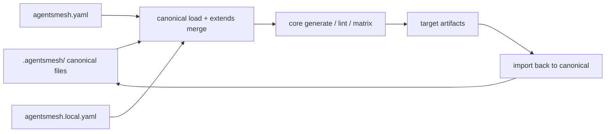

# Architecture Overview

AgentsMesh is a local-first configuration sync library for AI coding tools. Its core contract is simple:

1. `.agentsmesh/` is the only canonical source of truth for project content.
2. `agentsmesh.yaml` and `agentsmesh.local.yaml` control targets, features, conversions, and collaboration policy.
3. Target files such as `AGENTS.md`, `.claude/`, `.cursor/`, `.junie/`, `.github/`, and similar layouts are generated artifacts or import sources, not primary state.

## Primary architecture shape

- `src/cli`
  Command entrypoints, routing, and user-facing orchestration.
- `src/config`
  Config parsing, remote source parsing/fetching, extend resolution, and lock handling.
- `src/canonical`
  Canonical file parsing, extend loading, pack loading, and merge behavior.
- `src/core`
  Target-agnostic generation, reference rewriting, lint orchestration, and compatibility matrix logic.
- `src/install`
  Install discovery, selection, persistence, replay, sync, and pack materialization.
- `src/targets`
  Built-in target metadata plus target-specific import/generate/lint adapters.
- `src/utils`
  Low-level filesystem, text, output, and hashing helpers.

## Source-of-truth model

## Key runtime pipelines

- Generate:
  config load -> lock validation -> canonical+extends load -> core engine -> write artifacts -> write `.agentsmesh/.lock`
- Import:
  target selection -> target importer -> canonical serialization -> user regenerates into other targets
- Install:
  source parse/fetch -> discovery -> selection/conflict resolution -> extend or pack persistence -> generate
- Watch:
  chokidar ready -> initial generate -> debounce canonical/config changes -> regenerate -> optional matrix refresh

## Design principles already present in the code

- Canonical-first:
  local project content is normalized into one internal format before generation.
- Target adapters are isolated:
  target-specific file structures live under `src/targets/<tool>/`.
- Shared target metadata is centralized:
  built-in target ids, capabilities, import messaging, and generator lookup are sourced from `src/targets/catalog/builtin-targets.ts`.
- Pipeline stages are explicit:
  load, normalize, merge, generate, rewrite, and persist are distinct steps even when invoked by one CLI command.

## Current documentation map

- Container/component view:
  [containers.md](./containers.md)
- Critical flows:
  [flows/generate.md](./flows/generate.md)
  [flows/import.md](./flows/import.md)
  [flows/install.md](./flows/install.md)
  [flows/watch.md](./flows/watch.md)
- Domain boundaries:
  [domains/cli.md](./domains/cli.md)
  [domains/config.md](./domains/config.md)
  [domains/canonical.md](./domains/canonical.md)
  [domains/core.md](./domains/core.md)
  [domains/install.md](./domains/install.md)
  [domains/targets.md](./domains/targets.md)
  [domains/utils.md](./domains/utils.md)
- ADRs:
  [../adr/adr-canonical-source-of-truth.md](../adr/adr-canonical-source-of-truth.md)
  [../adr/adr-target-descriptor-catalog.md](../adr/adr-target-descriptor-catalog.md)
  [../adr/adr-feature-projection-policy.md](../adr/adr-feature-projection-policy.md)
  [../adr/adr-watch-lock-contract.md](../adr/adr-watch-lock-contract.md)
  [../adr/adr-packs-local-materialized-installs.md](../adr/adr-packs-local-materialized-installs.md)
